# Omotya Project

## Overview
This project presents the design of a 10-bit Successive Approximation Register (SAR) Analog-to-Digital Converter (ADC) aimed at achieving high-precision analog-to-digital conversion. This SAR ADC is intended for digital signal processing applications where accurate conversion of analog signals into digital data is crucial.

## Circuit
To realize digital input and output capabilities, we integrated a 10-bit Capacitive Digital-to-Analog Converter (CDAC) circuit into the input stage. This CDAC circuit features precise capacitor matching and a low-noise design, essential for maximizing the performance of our SAR ADC.

### Input Stage
Digital Input to Differential Analog Input Conversion

The heart of our SAR ADC design lies in its ability to convert digital input signals into differential analog input signals. This is achieved through a meticulously designed Charge Distribution Analog-to-Digital Converter (CDAC) circuit. The CDAC plays a crucial role in accurately converting digital input into corresponding analog voltage levels, which are essential for the SAR ADC's operation.
|layout|result|
|---|---|
|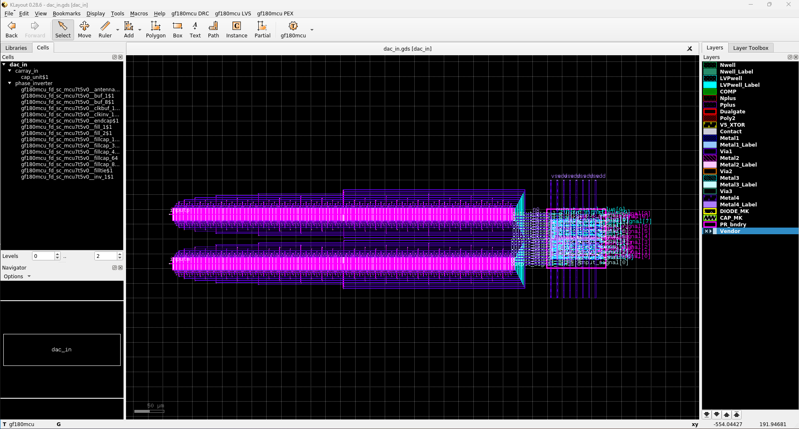|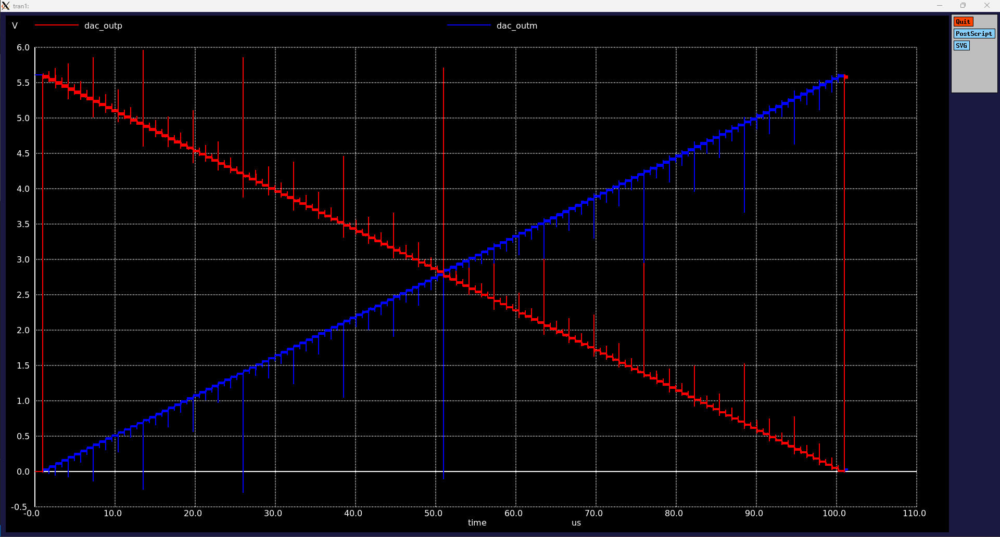|

### Bootstrapped Switch
Purpose of the Bootstrap Circuit

The bootstrap circuit included in our design serves a critical purpose in enhancing the performance of the SAR ADC. Its primary function is to stabilize the gate voltage of the switch transistors, ensuring minimal voltage drop across them. This stabilization is key to maintaining high linearity and efficiency, particularly in scenarios where the SAR ADC is dealing with varying input signal amplitudes.
|layout|result|
|---|---|
|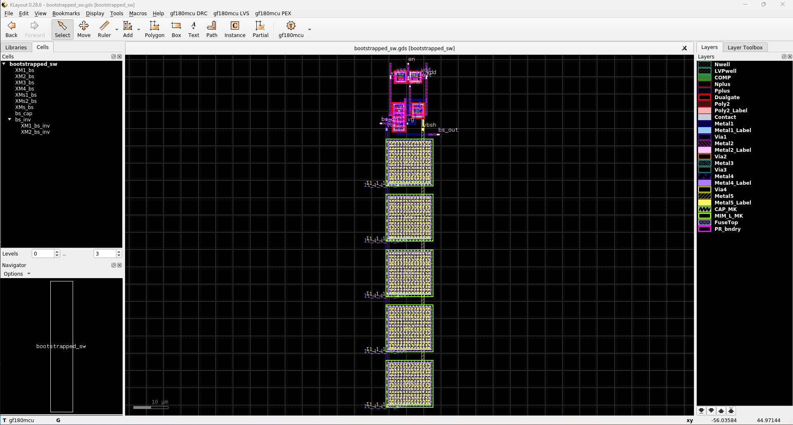|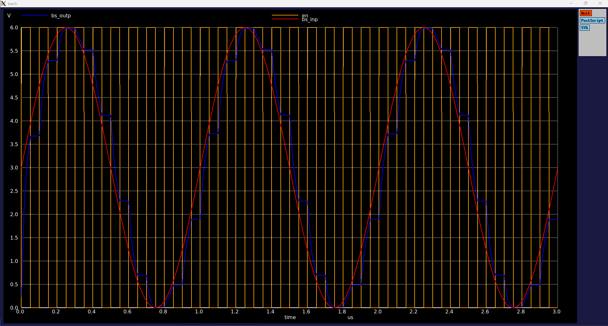|

### Comparator
Comparator Circuit Functionality

At the core of the SAR ADC's decision-making process is the comparator circuit. Its function is to compare the analog input signal with the reference voltage generated by the CDAC. Based on this comparison, the comparator determines the binary value of each bit in the ADC conversion process. The precision and speed of the comparator are vital in achieving high accuracy and fast conversion rates in the SAR ADC.
|layout|result|
|---|---|
|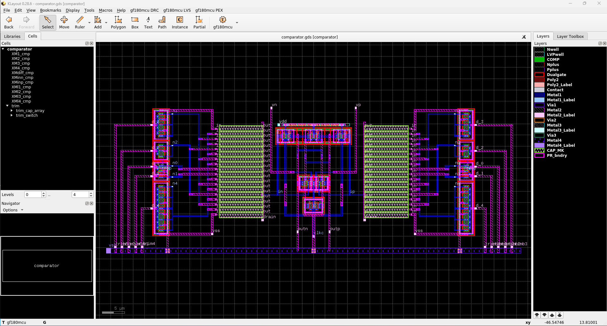|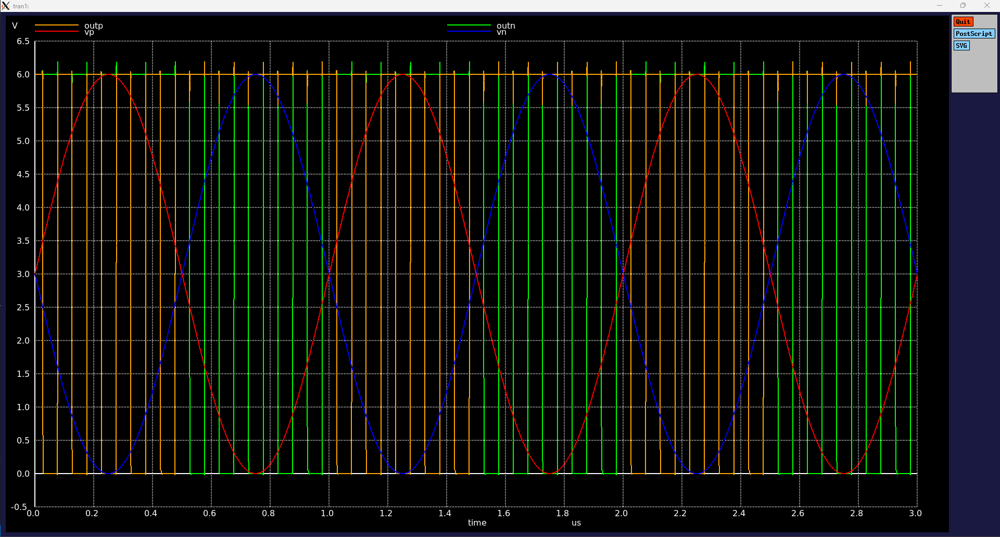|

### Latch

The latch circuit in our SAR ADC design serves to hold and stabilize the comparator's output. 

|layout|result|
|---|---|
|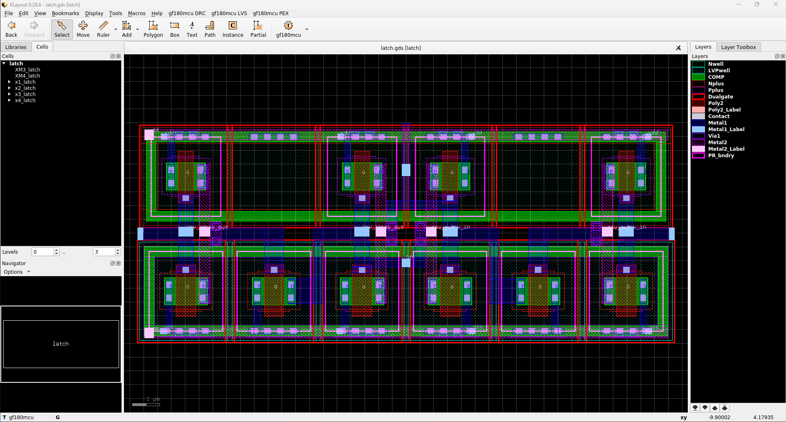|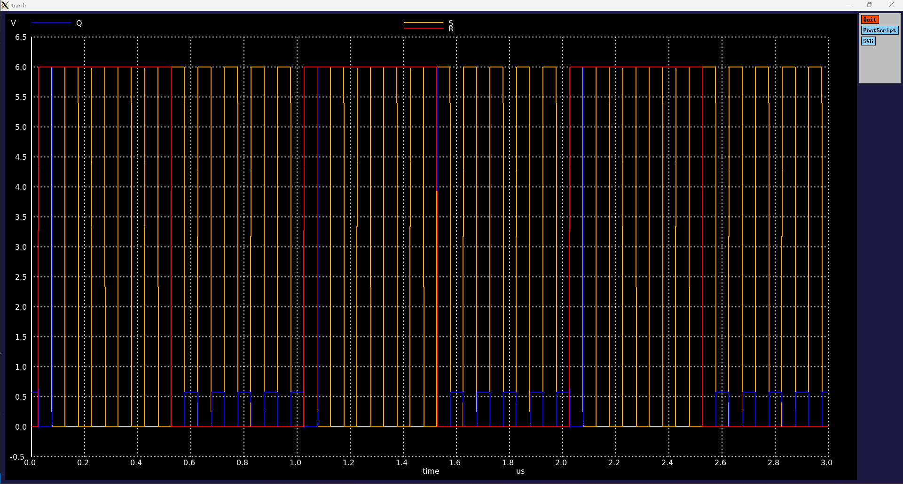|

### Logic

The sarlogic module in this SAR ADC design is a key component for implementing the classic Successive Approximation Register (SAR) algorithm along with offset calibration.

Functionality: It converts digital inputs into a differential analog input signal for the SAR ADC.
Clock and Reset Inputs: Uses a clock input (clk) and a negative logic reset signal (rstn) for synchronization and initialization.

Enabling and Sampling: An enable signal (en) and a sampling signal (sample) manage the timing of data conversion and calibration processes.

Comparator and Calibration: Interacts with a comparator output (comp) and a calibration signal (cal) to ensure accurate ADC results.

Control Outputs: Generates control signals (ctlp for positive, ctln for negative) and clock output (clk) for external synchronization.

Result and Validity Outputs: Provides a 10-bit result of the SAR ADC (result) and a validity signal (valid) to indicate the completion of data conversion.

Trimming and Offset Correction: Utilizes trimming values (trim, trimb) for fine-tuning the ADC's performance, ensuring precision and reducing offset errors.

|layout|
|---|
|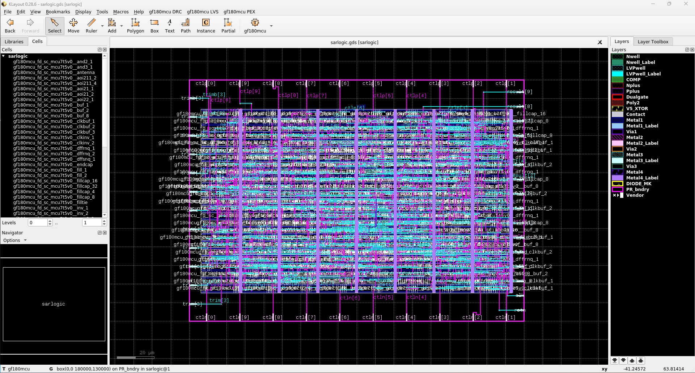|

|result1|result2|
|---|---|
|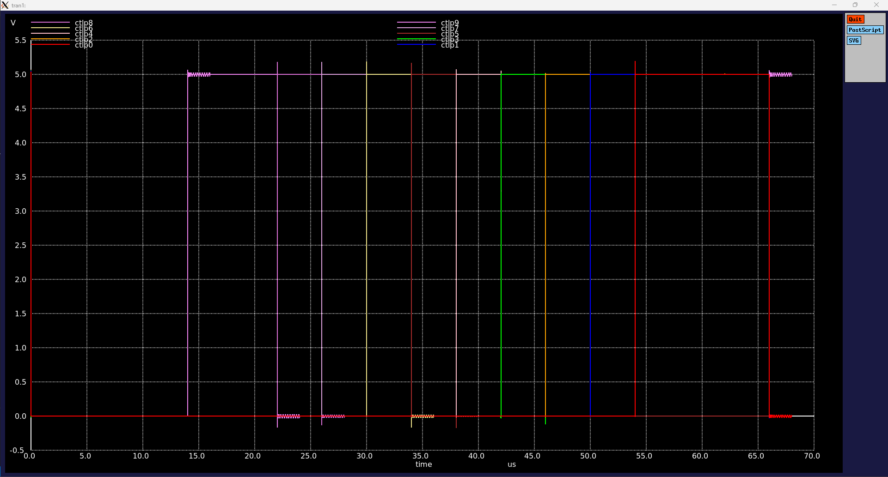||

### layout
|layout|
|---|
||

|result1|result2|
|---|---|
|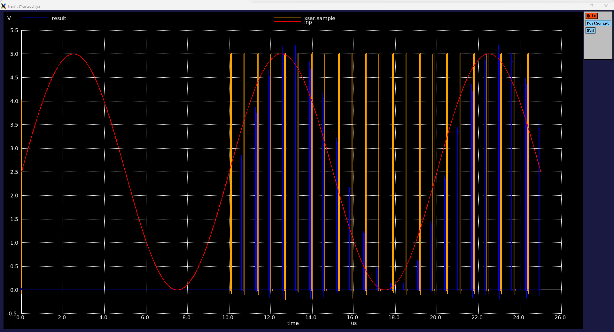|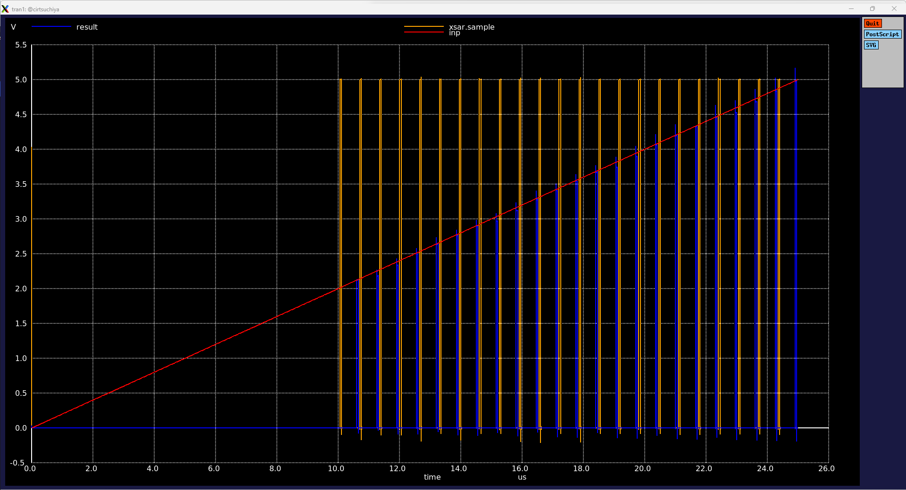|

## Logo Design
Additionally, we created an original logo to symbolize the uniqueness of this project. The logo is designed to represent the innovative nature and technical expertise of our work.
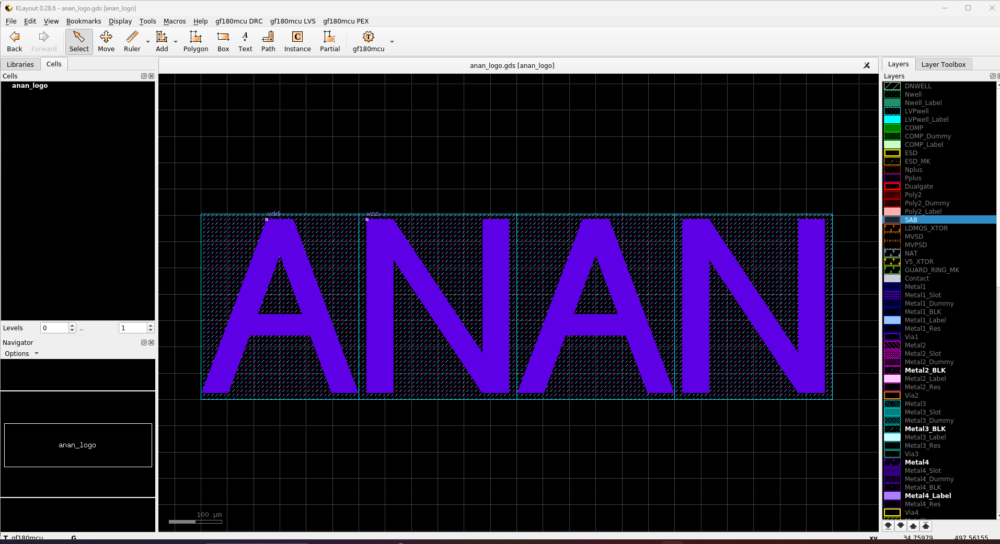

## user_project_wrapper.gds
|layout|
|---|
|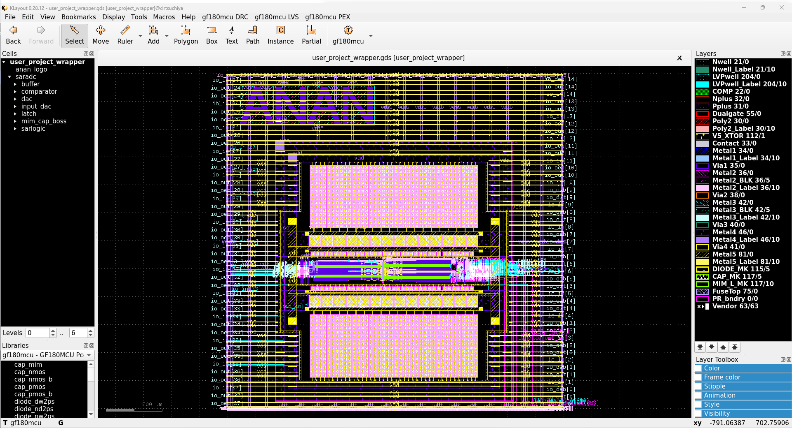|

## Future Outlook
Moving forward, we aim to continue evaluating and improving the performance of this SAR ADC, striving for even greater efficiency. We also plan to explore its applicability across various applications.