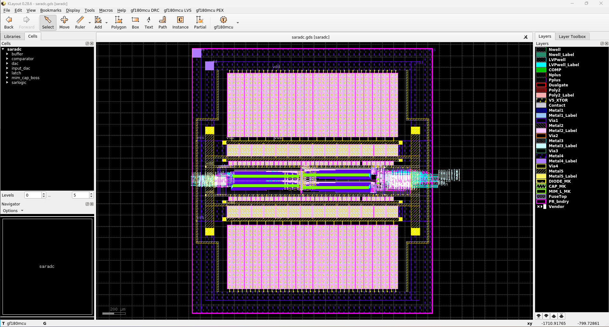

# 10-Bit SAR ADC Project

## Overview
This project presents the design of a 10-bit Successive Approximation Register (SAR) Analog-to-Digital Converter (ADC) aimed at achieving high-precision analog-to-digital conversion. This SAR ADC is intended for digital signal processing applications where accurate conversion of analog signals into digital data is crucial.

## Circuit
To realize digital input and output capabilities, we integrated a 10-bit Capacitive Digital-to-Analog Converter (CDAC) circuit into the input stage. This CDAC circuit features precise capacitor matching and a low-noise design, essential for maximizing the performance of our SAR ADC.

## Logo Design
Additionally, we created an original logo to symbolize the uniqueness of this project. The logo is designed to represent the innovative nature and technical expertise of our work.

## Future Outlook
Moving forward, we aim to continue evaluating and improving the performance of this SAR ADC, striving for even greater efficiency. We also plan to explore its applicability across various applications.